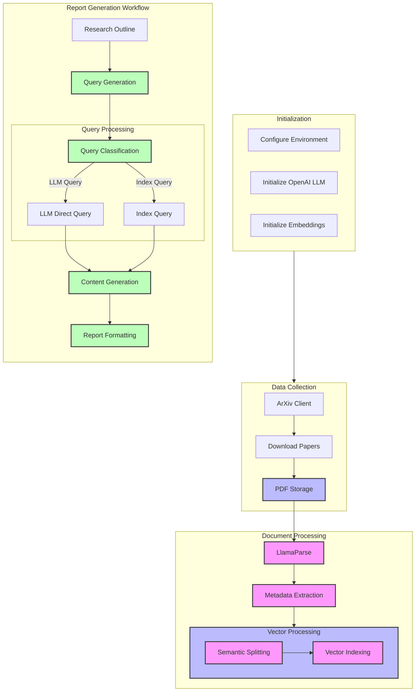

```mermaid
flowchart TB
    subgraph Init["Initialization"]
        config["Configure Environment"]
        llm["Initialize OpenAI LLM"]
        embed["Initialize Embeddings"]
    end

    subgraph Collection["Data Collection"]
        arxiv["ArXiv Client"]
        download["Download Papers"]
        pdf["PDF Storage"]
    end

    subgraph Processing["Document Processing"]
        parser["LlamaParse"]
        meta["Metadata Extraction"]
        direction TB
        subgraph vec["Vector Processing"]
            splitting["Semantic Splitting"]
            indexing["Vector Indexing"]
        end
    end

    subgraph ReportGen["Report Generation Workflow"]
        direction TB
        outline["Research Outline"]
        queries["Query Generation"]
        subgraph QueryProc["Query Processing"]
            direction LR
            classify["Query Classification"]
            llm_query["LLM Direct Query"]
            index_query["Index Query"]
        end
        content["Content Generation"]
        format["Report Formatting"]
    end

    Init --> Collection
    arxiv --> download
    download --> pdf
    pdf --> parser
    parser --> meta
    meta --> vec
    splitting --> indexing
    
    outline --> queries
    queries --> classify
    classify -->|LLM Query| llm_query
    classify -->|Index Query| index_query
    llm_query --> content
    index_query --> content
    content --> format
    
    %% Styling
    classDef process fill:#f9f,stroke:#333,stroke-width:2px
    classDef storage fill:#bbf,stroke:#333,stroke-width:2px
    classDef workflow fill:#bfb,stroke:#333,stroke-width:2px
    
    class parser,meta,splitting,indexing process
    class pdf,vec storage
    class queries,classify,content,format workflow
```