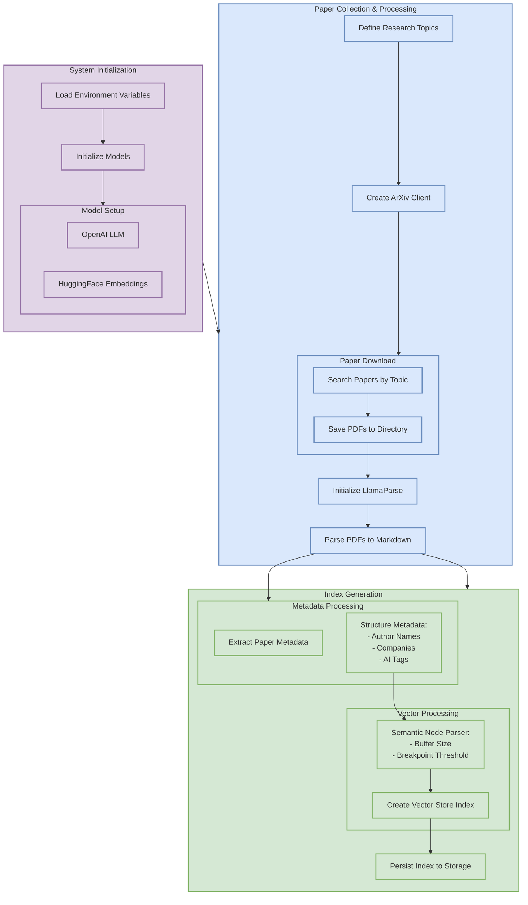

# Research Paper Report Generation

This project aims to generate a report on a set of research papers using a combination of RAG and agentic workflows. 

This project is based on an example from the LlamaIndex library with additional modifications.

## Overview

### Setup and Index Generation Workflow

### Inference Time and Report Generation Agentic Workflow

```mermaid
flowchart TB
    subgraph LoadResources["Resource Loading"]
        direction TB
        load_index["Load Index from Storage"]
        load_engine["Initialize Query Engine:
        - Dense Similarity
        - Sparse Similarity
        - Reranking"]
    end

    subgraph ReportGeneration["Report Generation Workflow"]
        direction TB
        outline["Research Outline Input"]
        subgraph OutlineProcessing["Outline Processing"]
            direction TB
            extract_title["Extract Report Title"]
            parse_sections["Parse Sections & Subsections"]
        end
        
        subgraph QueryGeneration["Query Generation"]
            direction TB
            gen_queries["Generate Queries per Section"]
            subgraph Classification["Query Classification"]
                direction LR
                classify["Classify Query Type"]
                llm_type["LLM-Based Query"]
                index_type["Index-Based Query"]
            end
        end

        subgraph ContentGeneration["Content Generation"]
            direction TB
            subgraph Processing["Query Processing"]
                direction LR
                llm_process["Process LLM Queries:
                - Direct Knowledge
                - General Concepts"]
                index_process["Process Index Queries:
                - Specific Facts
                - Recent Information"]
            end
            compile["Compile Section Contents"]
        end

        subgraph ReportFormatting["Report Formatting"]
            direction TB
            intro["Generate Introduction"]
            sections["Format Main Sections"]
            subsections["Format Subsections"]
            conclusion["Generate Conclusion"]
            final["Compile Final Report"]
        end
    end

    LoadResources --> ReportGeneration
    load_index --> load_engine
    
    outline --> OutlineProcessing
    extract_title --> parse_sections
    parse_sections --> gen_queries
    
    gen_queries --> classify
    classify --> llm_type
    classify --> index_type
    
    llm_type --> llm_process
    index_type --> index_process
    
    llm_process --> compile
    index_process --> compile
    compile --> ReportFormatting
    
    intro --> sections
    sections --> subsections
    subsections --> conclusion
    conclusion --> final

    %% Styling
    classDef load fill:#fff2cc,stroke:#d6b656,stroke-width:2px
    classDef process fill:#d5e8d4,stroke:#82b366,stroke-width:2px
    classDef query fill:#dae8fc,stroke:#6c8ebf,stroke-width:2px
    classDef format fill:#ffe6cc,stroke:#d79b00,stroke-width:2px
    
    class LoadResources,load_index,load_engine load
    class OutlineProcessing,QueryGeneration,Classification process
    class ContentGeneration,Processing,llm_process,index_process query
    class ReportFormatting,intro,sections,subsections,conclusion,final format
```
