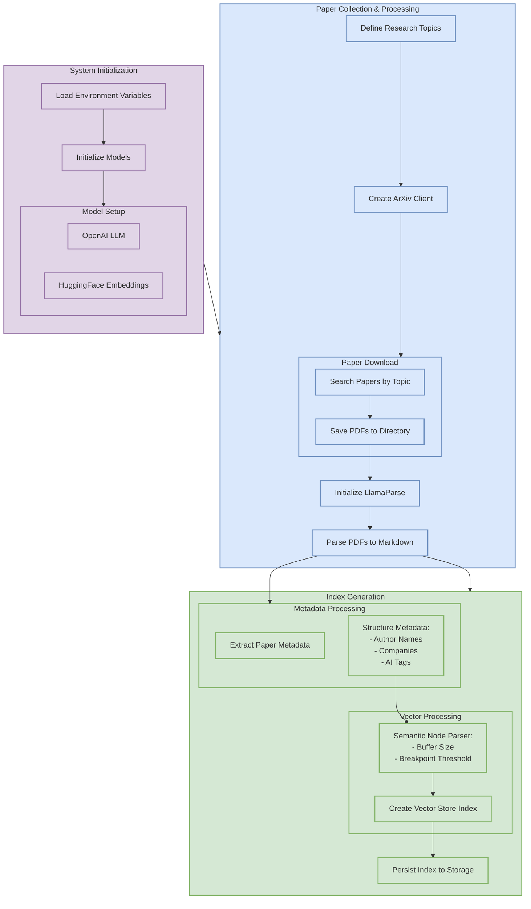

# Research Paper Report Generation

A powerful automated research assistant that leverages LlamaIndex, OpenAI, and ArXiv to download, analyze, and synthesize academic papers into comprehensive reports.

This system combines Retrieval-Augmented Generation (RAG) with intelligent agents to automatically process research papers and generate insightful reports, saving researchers valuable time while maintaining high-quality analysis.

Built on LlamaIndex's foundation, this project extends the core functionality with enhanced features for academic research workflows.

## Architecture


### Setup and Index Generation Workflow


### Inference Time and Report Generation Agentic Workflow

```mermaid
flowchart TB
    subgraph LoadResources["Resource Loading"]
        direction TB
        load_index["Load Index from Storage"]
        load_engine["Initialize Query Engine:
        - Dense Similarity
        - Sparse Similarity
        - Reranking"]
    end

    subgraph ReportGeneration["Report Generation Workflow"]
        direction TB
        outline["Research Outline Input"]
        subgraph OutlineProcessing["Outline Processing"]
            direction TB
            extract_title["Extract Report Title"]
            parse_sections["Parse Sections & Subsections"]
        end
        
        subgraph QueryGeneration["Query Generation"]
            direction TB
            gen_queries["Generate Queries per Section"]
            subgraph Classification["Query Classification"]
                direction LR
                classify["Classify Query Type"]
                llm_type["LLM-Based Query"]
                index_type["Index-Based Query"]
            end
        end

        subgraph ContentGeneration["Content Generation"]
            direction TB
            subgraph Processing["Query Processing"]
                direction LR
                llm_process["Process LLM Queries:
                - Direct Knowledge
                - General Concepts"]
                index_process["Process Index Queries:
                - Specific Facts
                - Recent Information"]
            end
            compile["Compile Section Contents"]
        end

        subgraph ReportFormatting["Report Formatting"]
            direction TB
            intro["Generate Introduction"]
            sections["Format Main Sections"]
            subsections["Format Subsections"]
            conclusion["Generate Conclusion"]
            final["Compile Final Report"]
        end
    end

    LoadResources --> ReportGeneration
    load_index --> load_engine
    
    outline --> OutlineProcessing
    extract_title --> parse_sections
    parse_sections --> gen_queries
    
    gen_queries --> classify
    classify --> llm_type
    classify --> index_type
    
    llm_type --> llm_process
    index_type --> index_process
    
    llm_process --> compile
    index_process --> compile
    compile --> ReportFormatting
    
    intro --> sections
    sections --> subsections
    subsections --> conclusion
    conclusion --> final

    %% Styling
    classDef load fill:#fff2cc,stroke:#d6b656,stroke-width:2px
    classDef process fill:#d5e8d4,stroke:#82b366,stroke-width:2px
    classDef query fill:#dae8fc,stroke:#6c8ebf,stroke-width:2px
    classDef format fill:#ffe6cc,stroke:#d79b00,stroke-width:2px
    
    class LoadResources,load_index,load_engine load
    class OutlineProcessing,QueryGeneration,Classification process
    class ContentGeneration,Processing,llm_process,index_process query
    class ReportFormatting,intro,sections,subsections,conclusion,final format
```


## Features

- Automated research paper download from ArXiv
- PDF parsing and text extraction using LlamaParse
- Metadata extraction (authors, companies, AI tags)
- Vector-based paper indexing
- Intelligent query processing
- Automated report generation with customizable outlines

## Prerequisites

- Python 3.11+
- OpenAI API key
- LlamaParse API key

## Required Libraries

```bash
pip install nest-asyncio python-dotenv llama-index arxiv llama-parse pydantic
```

## Environment Setup

Create a `.env` file in your project root with:

```plaintext
OPENAI_API_KEY=your_openai_api_key
LLAMA_CLOUD_API_KEY=your_llamaparse_api_key
```

## Project Structure

The output of the system is a report in the `research_results` directory.
```
research_results/
├── {topic_names}/
│   ├── pdfs/           # Downloaded research papers
│   ├── storage/        # Vector index storage
│   └── report.md       # Generated report
```

## Usage

1. Configure Research Topics in the `main.ipynb` file.
```python
research_paper_topics = ["Your", "Topics"]
num_results_per_topic = 2  # Number of papers per topic
```

2. Define Report Outline in the `main.ipynb` file.
```python
outline = """
# Your Report Title

## 1. Introduction

## 2. Main Sections
2.1. Subsection One
2.2. Subsection Two

## 3. Conclusion
"""
```

3. Run the Analysis:
```python
# Initialize the agent
agent = ReportGenerationAgent(
    query_engine=query_engine,
    llm=llm,
    verbose=True
)

# Generate report
report = await agent.run(outline=outline)
```

## System Components

### 1. Paper Collection
- Uses ArXiv API to search and download recent papers
- Automatically saves PDFs to local storage

### 2. Document Processing
- Converts PDFs to markdown format using LlamaParse
- Extracts metadata including authors and affiliations
- Generates embeddings for semantic search

### 3. Indexing
- Creates semantic splits of documents
- Builds vector store index for efficient retrieval
- Persists index to disk for reuse

### 4. Report Generation
- Processes custom report outlines
- Generates targeted queries for each section
- Classifies queries as LLM-based or index-based
- Compiles comprehensive research reports

## Query Engine Configuration

The system uses a hybrid query engine with:
- Dense similarity search (top k=10)
- Sparse similarity search (top k=10)
- Reranking enabled (top n=5)
- Chunk-based retrieval

## Workflow Visualization

The system includes two workflow visualizations:
- `report_generation_agent.html`: Shows all possible workflow paths
- `report_generation_agent_execution.html`: Shows the most recent execution path

## Customization

You can customize:
- Research topics and paper count
- Report outline structure
- Query engine parameters
- LLM and embedding models
- Semantic splitting parameters
